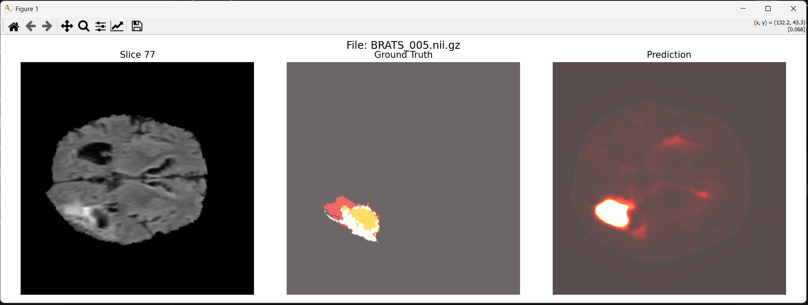
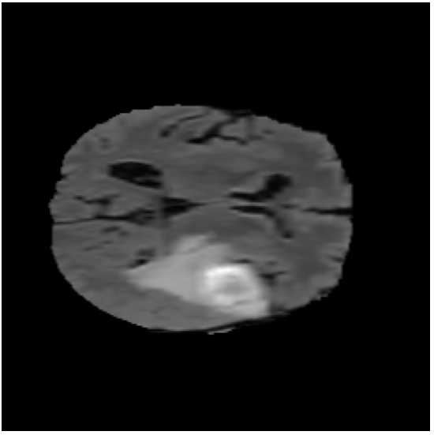
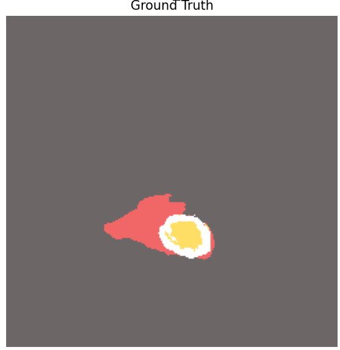
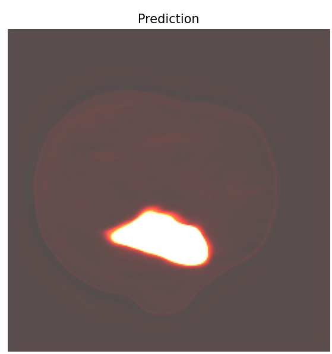

# Preview



## Brain MRI Tumor Segmentation using U-Net

Deep learning-based brain tumor segmentation on MRI scans using a U-Net architecture implemented in Python and PyTorch.

---

## Project Overview

## Overview

This project was developed as part of my learning journey in Medical Image Analysis and Deep Learning. It focuses on brain tumor segmentation from MRI scans using a U-Net-based deep learning model implemented in PyTorch.

A pre-trained U-Net model is used to generate tumor segmentation masks from brain MRI slices and compare the predictions with the corresponding ground truth annotations.

The project also includes an interactive visualization tool that enables users to navigate through MRI scans slice by slice and visually evaluate segmentation performance by comparing the original MRI, ground truth mask, and model prediction.

---

## Features

* Brain MRI tumor segmentation
* U-Net based neural network
* NIfTI (`.nii.gz`) medical image support
* GPU acceleration with CUDA (if available)
* Interactive slice navigation
* Ground Truth vs Prediction comparison
* MRI volume exploration using keyboard controls

---

## Dataset

The project uses the Medical Segmentation Decathlon Brain Tumor dataset structure:

```text
Task01_BrainTumour/
├── imagesTr/
└── labelsTr/
```

MRI scans and corresponding segmentation masks are stored in NIfTI format.

You can download the dataset from:

[https://msd-for-monai.s3-us-west-2.amazonaws.com/Task01_BrainTumour.tar]

---

## Model Architecture

The segmentation model is based on the U-Net architecture, a widely used convolutional neural network for biomedical image segmentation.

Input:

* Single MRI slice

Output:

* Binary tumor segmentation mask

---

## Project Structure

```text
Medical-Segmentation-Project/
│
├── images/
│   └── viewer.png
│
├── Task01_BrainTumour/
│   ├── imagesTr/
│   ├── imagesTs/
│   ├── labelsTr/
│   └── dataset.json
│
├── main.py
├── viewer.py
├── unet.py
│
├── train_unet.py
├── train_self_supervised.py
├── Self-Supervised-Learning.py
│
├── trained_model.pth
├── pretrained_autoencoder.pth
│
├── requirements.txt
├── README.md
└── .gitignore
```

---

## Installation

Clone the repository:

```bash
git clone [https://github.com/FatemehTech/brain-mri-segmentation.git]
cd brain-mri-segmentation
```

Install dependencies:

```bash
pip install -r requirements.txt
```

---

## Usage

Before running the application, make sure the following files are available:

trained_model.pth
Task01_BrainTumour/imagesTr
Task01_BrainTumour/labelsTr

Run the application:

```bash
python main.py
```

The model will load automatically and display MRI slices together with the corresponding ground truth and predicted segmentation masks.

---

## Keyboard Controls

| Key | Action                              |
| --- | -------------------                 |
| →   | Next Slice in Current Scan          |
| ←   | Previous Slice in Current Scan      |
| ↑   | Load Next Patient Scan              |
| ↓   | Load Previous Patient Scan          |

---

## Results

### Input MRI



### Ground Truth Mask



### Predicted Segmentation



---

## Example Visualization

The viewer displays:

* Original MRI slice
* Ground truth tumor mask
* U-Net prediction

allowing direct visual comparison of segmentation performance.

---

## Technologies Used

* Python
* PyTorch
* NumPy
* Matplotlib
* NiBabel

---

## Future Improvements

* Dice Score evaluation
* Multi-class tumor segmentation
* 3D U-Net implementation
* Model training pipeline
* Automatic performance metrics
* Web-based visualization dashboard

---

## Author

[Fatemeh Aghajani]
Computer Vision & Medical Image Analysis Enthusiast
GitHub:[https://github.com/FatemehTech]
